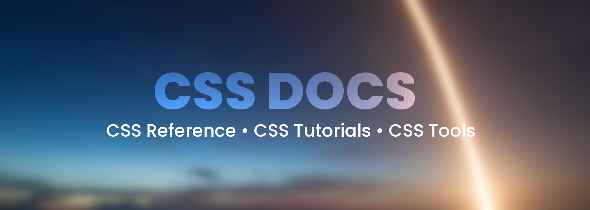
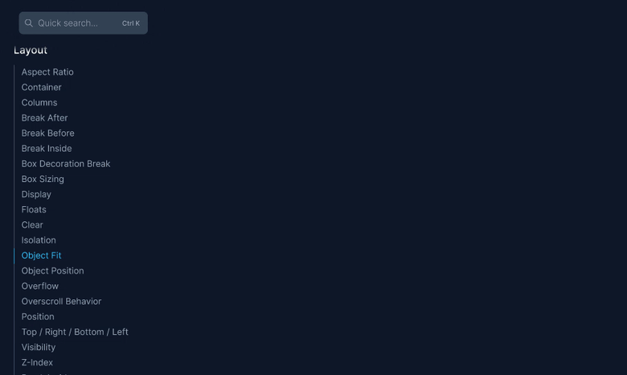
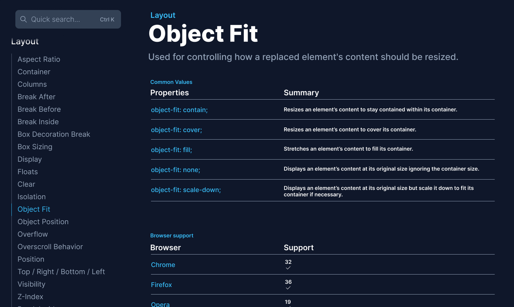
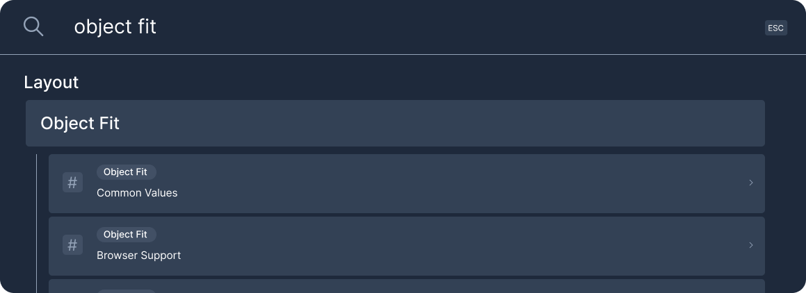
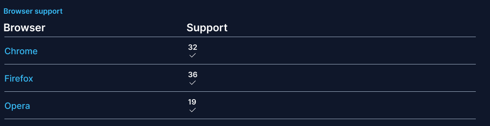

    
    
	
    

___

CSS Docs is a repository for anything related to CSS!

- **CSS Reference** to learn the details about CSS properties, values, and selectors.
- **CSS Tutorials** to learn how CSS is used to style common elements like buttons, tooltips, and form elements.
- **CSS Tools** to quickly generate anything you might need, including box shadows and mesh gradients.

## Installation :white_check_mark:

Coming soon…

## Usage :checkered_flag:

### Quick Search

### Browser Support

## Contact Us :hugs:

Get in touch with us in the [Discord Server](https://discord.gg/PGa5q7A9H3)!

## Contributions

Coming soon…